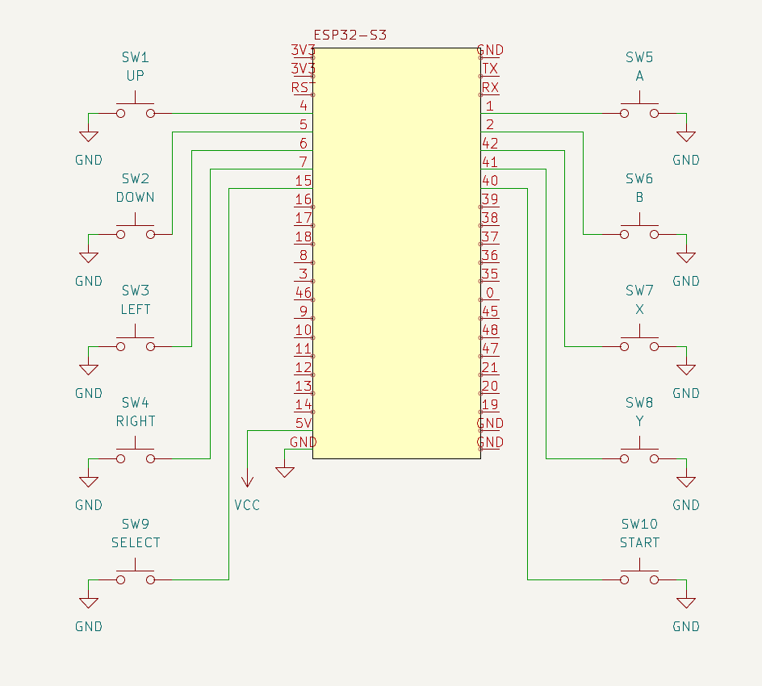

BLEEP (Bluetooth Low-Energy Entertainment Pad) is a DIY gamepad. It uses the [ESP32-BLE-GamePad](https://github.com/lemmingDev/ESP32-BLE-Gamepad) library on an ESP32-S3.

## Schematic

## BOM

| Component | Quantity |
| --------- | -------- |
| ESP32-S3  | 1        |
| SPST Push Button | 1 |
| Wire      | N/A      |
| USB-C Cable | 1      |

## Prerequisites
### Arduino IDE
Arduino IDE must be set up and configured for your particular board.

### ESP32-BLE-Gamepad
The [ESP32-BLE-GamePad](https://github.com/lemmingDev/ESP32-BLE-Gamepad) library must be intalled and configured in Arduino IDE.

## Instructions

Use the schematic above to connect buttons, ESP32-S3, and battery (optional). 

Once wired, open the source file in the Arduino IDE. Compile and upload the sketch to the ESP32-S3 using a USB-C cable connecting the ESP32-S3 to the PC running Arduino IDE.

After the ESP32-S3 is flashed, the device will be visible by the PC or device using Bluetooth. Find and connect to the ESP32-S3 (Listed as `BLEEP Controller` by default). 

Once connected to the ESP32-S3, start a game or application with controller support. 

>**Note**: You will need to manually configure buttons in the input profile. BLE devices (such as BLEEP) do not support automatic mappings.